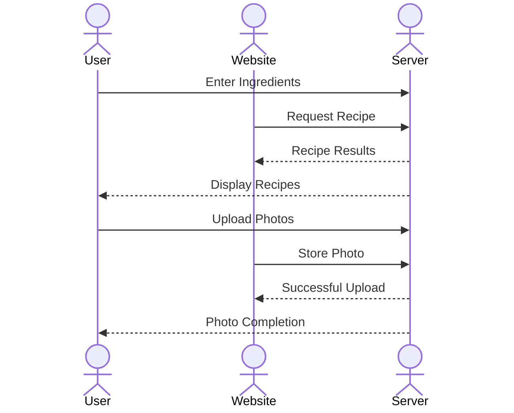

# Food Fetch

[My Notes](notes.md)

Food Fetch is an application that provides recipes to all of its users. Enter ingredients and receive ideas for recipes that can be made with those ingredients, or simply look up a desired dish and options will be provided. Upload photos or recipes of your own dishes that have been made!

## 🚀 Specification Deliverable

For this deliverable I did the following. I checked the box `[x]` and added a description for things I completed.

- [x] Proper use of Markdown
- [x] A concise and compelling elevator pitch
- [x] Description of key features
- [x] Description of how you will use each technology
- [x] One or more rough sketches of your application. Images must be embedded in this file using Markdown image references.

### Elevator pitch

Have you ever had a random assortment of ingredients in your pantry and fridge that you don't know what to do with? The Food Fetch app makes it so that you can enter ingredients that you have in your household that you need to use up and the application spits out recipes that contain those ingredients. If you already have an idea of what you would like to cook, find the top recipes of that dish or similar dishes you could make. Upload photos of your dishes and share it with the rest of the Food Fetch community!

### Design

Here is a sequence diagram that shows how people would interact with the website and the server to upload their own photos and ingredients.

### Key features

- Secure login over HTTPS
- Ability to post photos
- Ability to view photo gallery in real time
- Photos are persistently stored
- Display of recipes
- Ability to enter ingredients for recipes

### Technologies

I am going to use the required technologies in the following ways:

- **HTML** - Uses appropriate HTML format for the application. Three HTML Pages. One for user login, one for displaying recipes, one for uploading and photo gallery of other people's recipes. Hyperlinks to lead to online recipes. Is easy to navigate.
- **CSS** - Styling that accommodates different-sized screens. Site is aesthetically pleasing (format, colorway, spacing).
- **React** - Displays other people's photos, uploading photos, and use of React for routing and components.
- **Service** - Backend Service for retrieving photos, login.
- **DB/Login** - Store photos, store users. Register and login users. Can't post unless authenticated.
- **WebSocket** - As each user posts photos, their photos are broadcast to all other users.

## 🚀 AWS deliverable

For this deliverable I did the following. I checked the box `[x]` and added a description for things I completed.

- [x] **Server deployed and accessible with custom domain name** - [My server link](https://foodfetch.click).

## 🚀 HTML deliverable

For this deliverable I did the following. I checked the box `[x]` and added a description for things I completed.

- [x] **HTML pages** - I created three different HTML pages - index.html, recipe.html, and photo.html. Each has a basic structure of what will be displayed on the screen.
- [ ] **Proper HTML element usage** - I did not complete this part of the deliverable.
- [x] **Links** - Linked my GitHub repository, as well as links that allow for navigation between web pages. Each of the three HTML pages can be called from any of the other two HTML pages at any given time.
- [x] **Text** - Added text into all three HTML pages. Some text is used as a placeholder, while other text is used as an example of what the site may look at when in use.
- [x] **3rd party API placeholder** - Placed the 3rd party APT placeholder on my recipes page. I listed a few ingredients that could be entered and put the placeholder directly underneath for when it is called.
- [ ] **Images** - I did not complete this part of the deliverable.
- [x] **Login placeholder** - The login placeholder is located on index.html. This is the page that each user will be directed to when they first enter Food Fetch. They will need to login here, in order to access the rest of the site.
- [ ] **DB data placeholder** - I did not complete this part of the deliverable.
- [ ] **WebSocket placeholder** - I did not complete this part of the deliverable.

## 🚀 CSS deliverable

For this deliverable I did the following. I checked the box `[x]` and added a description for things I completed.

- [ ] **Visually appealing colors and layout. No overflowing elements.** - I did not complete this part of the deliverable.
- [ ] **Use of a CSS framework** - I did not complete this part of the deliverable.
- [ ] **All visual elements styled using CSS** - I did not complete this part of the deliverable.
- [ ] **Responsive to window resizing using flexbox and/or grid display** - I did not complete this part of the deliverable.
- [ ] **Use of a imported font** - I did not complete this part of the deliverable.
- [ ] **Use of different types of selectors including element, class, ID, and pseudo selectors** - I did not complete this part of the deliverable.

## 🚀 React part 1: Routing deliverable

For this deliverable I did the following. I checked the box `[x]` and added a description for things I completed.

- [ ] **Bundled using Vite** - I did not complete this part of the deliverable.
- [ ] **Components** - I did not complete this part of the deliverable.
- [ ] **Router** - I did not complete this part of the deliverable.

## 🚀 React part 2: Reactivity deliverable

For this deliverable I did the following. I checked the box `[x]` and added a description for things I completed.

- [ ] **All functionality implemented or mocked out** - I did not complete this part of the deliverable.
- [ ] **Hooks** - I did not complete this part of the deliverable.

## 🚀 Service deliverable

For this deliverable I did the following. I checked the box `[x]` and added a description for things I completed.

- [ ] **Node.js/Express HTTP service** - I did not complete this part of the deliverable.
- [ ] **Static middleware for frontend** - I did not complete this part of the deliverable.
- [ ] **Calls to third party endpoints** - I did not complete this part of the deliverable.
- [ ] **Backend service endpoints** - I did not complete this part of the deliverable.
- [ ] **Frontend calls service endpoints** - I did not complete this part of the deliverable.
- [ ] **Supports registration, login, logout, and restricted endpoint** - I did not complete this part of the deliverable.

## 🚀 DB deliverable

For this deliverable I did the following. I checked the box `[x]` and added a description for things I completed.

- [ ] **Stores data in MongoDB** - I did not complete this part of the deliverable.
- [ ] **Stores credentials in MongoDB** - I did not complete this part of the deliverable.

## 🚀 WebSocket deliverable

For this deliverable I did the following. I checked the box `[x]` and added a description for things I completed.

- [ ] **Backend listens for WebSocket connection** - I did not complete this part of the deliverable.
- [ ] **Frontend makes WebSocket connection** - I did not complete this part of the deliverable.
- [ ] **Data sent over WebSocket connection** - I did not complete this part of the deliverable.
- [ ] **WebSocket data displayed** - I did not complete this part of the deliverable.
- [ ] **Application is fully functional** - I did not complete this part of the deliverable.
